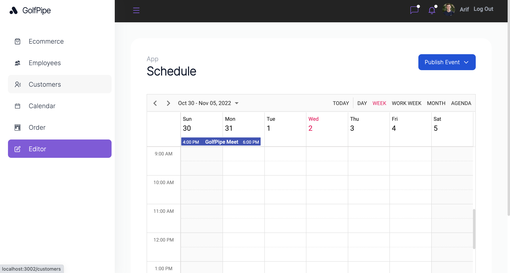

**GolfPipe Dashboard**

In our dashboard have 6 main pages for changing somethings.

WebPage's API created by NodeJs and MongoDB.

In design, we use generally Tailwind.css and some Packages for visualization.

On the Employee page, you can see employees, can add, update, delete and see more details about them.

On the Cutomers page, you can see our customer companies,can see more details about them. In detail page, have deal list and also Notes section. Every company can add note in here with own name.

On the Order Page,you can see orders in normal table view or dropable table view(For seeing another view,click Pipeline button in page), so you can add, update, delete deals.

In Editor Page we see a great schedule for planning our tasks.
The schedule is also working with drop and down.
You can see all tasks with Daily,Weekly,Monthly view.
And also all tasks are waiting you on Agenda!

In Dashboard have Authentication.
It depends on MongoDb API. You must be logged in for seeing other pages.
Download and test it!

npm install
npm start
Happy Hacking!